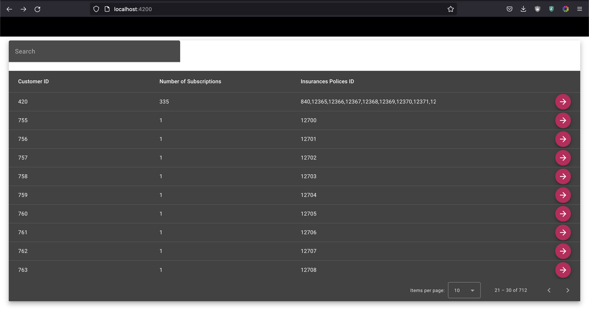
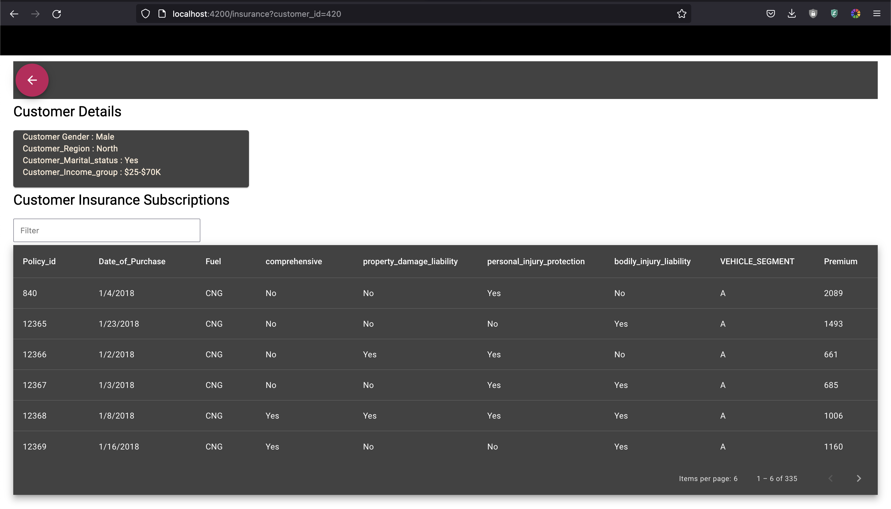

# Mapersive Tech Assessment
In this article, we are going to present the developed solution and then discuss the obstacles and difficulties, decisions we made, and finally, some to-dos to enhance the solution further.

## Results 
- Main Screen.

On this screen, we present the customers registered in our system, along with their number of subscriptions (the count of policies they have), thier insurance policy IDs, and finally, a button to access more information.

To improve loading times, we have implemented progressive loading, which means that data is loaded only when the customer navigates through the pages.

- Search by Customer ID 

We can search for customer. This functionality allows us to perform a search using a string, and the table will display all customers whose IDs start with the provided string

- Customer Details Screen.

This screen displays two sections.

The first section contains customer details.

The second section is a table that provides more information about the insurance policies to which the customer has subscribed.

## Challenges

- The requirements aren't clear.
- The provided data isn't clean.

## Decisions.

1. Remove Duplicate Items: 
Remove the items with the same policy_id (3 in total).

2. Divide the Data into Separate Entities:
Divide the provided data into separate entities: Customer and Insurance, each with its own columns.

3. Implement Progressive Loading:
Implement progressive loading to reduce the loading time for customers.

4. Insurance Subscriptions:
In the customer details view, we loaded the insurance subscriptions all at once (without implementing progressive loading) because a customer can typically be subscribed to only a few hundred insurances at most.

## Todos 
- Implement a Caching System to Cache Customer Data.
- Improve the Responsiveness of the Solution.

